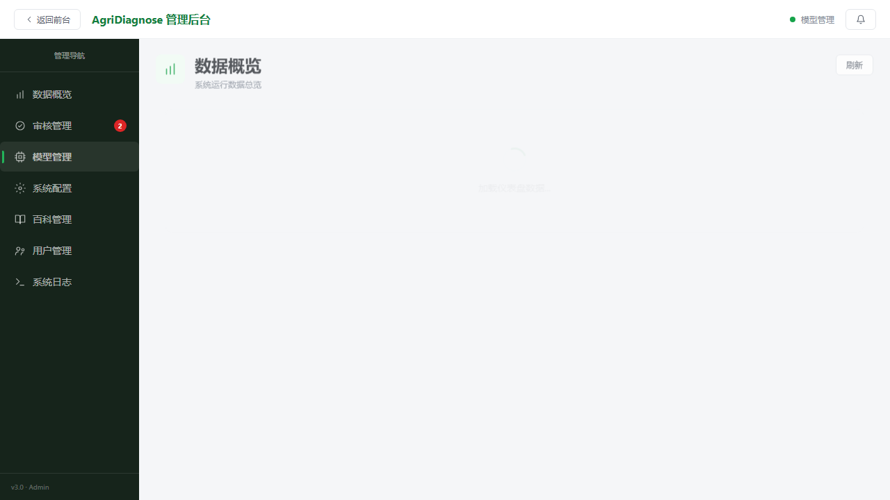
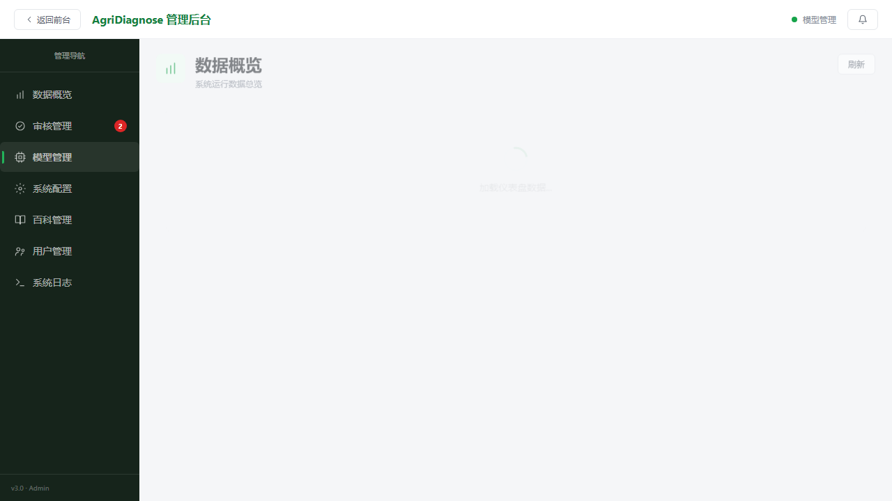
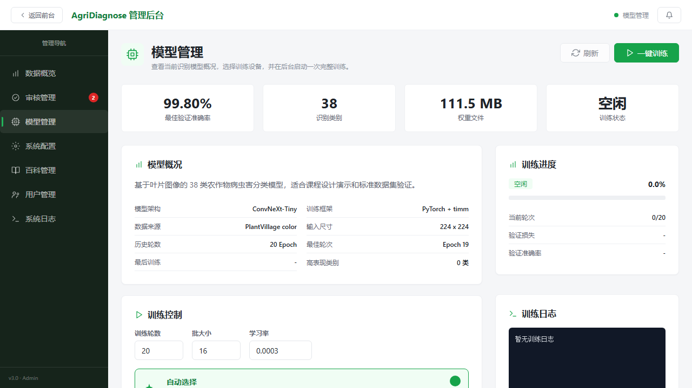

<p align="center">
  
  
  
  
  
</p>

<h1 align="center">🌾 AgriDiagnose</h1>
<h3 align="center">农作物病虫害智能诊断系统</h3>

<p align="center">
  <b>上传叶片图片 → AI 识别病害 → 获取防治建议</b><br>
  深度学习 + Web 应用 + 大模型 Agent 一体化
</p>

---

## 📑 目录

- [✨ 项目简介](#-项目简介)
- [🎯 主要功能](#-主要功能)
- [📸 界面预览](#-界面预览)
- [🏗️ 系统架构](#️-系统架构)
- [🛠️ 技术栈](#️-技术栈)
- [📁 项目目录](#-项目目录)
- [🧠 模型训练](#-模型训练)
- [🚀 Web 系统运行](#-web-系统运行)
- [📱 前端页面](#-前端页面)
- [🔌 后端 API 概览](#-后端-api-概览)
- [🤖 Agent 配置](#-agent-配置)
- [🔐 管理员后台](#-管理员后台)
- [🔄 数据流闭环](#-数据流闭环)
- [⚠️ 注意事项](#️-注意事项)
- [📄 许可证](#-许可证)

---

## ✨ 项目简介

AgriDiagnose 是一个面向农作物叶片图像的病虫害智能诊断系统。项目以 **ConvNeXt-Tiny** 深度学习分类模型为核心，结合 **Vue3 Web 应用** 和 **大模型 Agent**，实现从叶片图片上传、病害识别、结果可视化，到防治建议生成、历史统计、数据贡献和后台管理的一体化流程。

> 💡 **工作流程：** 上传叶片图片 → 模型识别 38 类病害/健康状态 → Top-3 预测结果 + 置信度 → Agent 生成症状分析、风险提示和防治建议

---

## 🎯 主要功能

| 功能 | 说明 |
|------|------|
| 🔬 **智能诊断** | 上传叶片图片，自动识别农作物病害或健康状态 |
| 🏆 **Top-3 预测** | 展示最可能的 3 个分类结果及置信度 |
| 🇨🇳 **中文结果** | 中英文标签映射，输出作物名称、病害名称和中文类别 |
| 📋 **历史记录** | 保存每次诊断的图片、时间、Top-1 和 Top-3 结果 |
| 📊 **统计分析** | 根据历史诊断记录统计病害类别分布 |
| 🤖 **AI 对话** | 基于诊断结果调用大模型 Agent，生成结构化防治建议 |
| 📤 **数据贡献** | 用户可上传补充样本，支持扩展已有类别或提交新增病害类型 |
| ⚙️ **管理员后台** | 贡献审核、数据概览、模型管理、训练控制、百科管理、系统配置、日志查看 |
| 📖 **病害百科** | 病害条目浏览、筛选、详情查看和后台维护 |

---

## 📸 界面预览

<p align="center">
  <em>管理后台 — 模型管理页面</em>
</p>

<p align="center">
  
  
</p>

<p align="center">
  
</p>

---

## 🏗️ 系统架构

```text
                         ┌─────────────────────┐
                         │    用户浏览器         │
                         │  Vue3 前端单页应用    │
                         └──────────┬──────────┘
                                    │  REST API / SSE
                                    ▼
                         ┌─────────────────────┐
                         │   FastAPI 后端服务    │
                         └──────────┬──────────┘
                                    │
          ┌─────────────┬───────────┼───────────┬─────────────┐
          │             │           │           │             │
          ▼             ▼           ▼           ▼             ▼
   ┌──────────┐  ┌──────────┐ ┌──────────┐ ┌──────────┐ ┌──────────┐
   │ 分类模型  │  │历史/统计  │ │数据贡献  │ │病害百科  │ │Agent桥接 │
   │ConvNeXt  │  │  服务     │ │  服务    │ │  服务    │ │  服务    │
   │ -Tiny    │  │          │ │          │ │          │ │          │
   └──────────┘  └──────────┘ └──────────┘ └──────────┘ └──────────┘
```

---

## 🛠️ 技术栈

| 层级 | 技术 |
|------|------|
| 🧠 **深度学习** | PyTorch · torchvision · timm |
| 🏷️ **分类模型** | ConvNeXt-Tiny · ImageNet 预训练 |
| ⚡ **后端服务** | Python · FastAPI · Uvicorn |
| 🎨 **前端应用** | Vue 3 CDN · Pinia · ECharts · 原生 ES Modules |
| 🖼️ **图像处理** | Pillow |
| 🤖 **大模型 Agent** | OpenAI 兼容 chat/completions 接口 |
| 💾 **数据存储** | JSON 文件存储 · 上传图片本地保存 |
| 📚 **数据集** | PlantVillage 叶片图像数据集 |

---

## 📁 项目目录

```text
AgriDiagnose/
├── 📄 1.Docs/                   项目设计与模块说明文档
├── 🧠 2.Model/                  图像分类模型训练与推理
│   ├── Data/                    数据集、类别映射、用户贡献样本
│   ├── Weights/                 训练权重与训练历史
│   ├── scripts/                 数据下载、数据划分等脚本
│   ├── config.py                训练与推理配置
│   ├── data.py                  数据加载与数据增强
│   ├── model.py                 ConvNeXt-Tiny 模型构建
│   ├── train.py                 模型训练入口
│   ├── infer.py                 单张图片推理入口
│   └── utils.py                 工具函数
├── 🌐 3.Web/                    Web 应用
│   ├── Backend/                 FastAPI 后端
│   │   ├── app/main.py          API 路由与应用入口
│   │   ├── app/services/        分类、贡献、百科、Agent 服务
│   │   ├── app/data/            百科、配置、用户等 JSON 数据
│   │   ├── uploads/             用户诊断上传图片
│   │   ├── logs/                日志与截图文件
│   │   └── run.py               后端启动脚本
│   └── Frontend/                Vue3 前端单页应用
│       ├── index.html           前端入口
│       ├── css/                 页面样式
│       └── js/                  路由、状态、API、页面组件
├── 🤖 4.Agent/                  大模型 Agent 模块
│   ├── agent.py                 LLM 调用封装
│   ├── config.py                LLM 配置读取
│   └── prompt.py                Prompt 模板
├── 🧪 5.Test/                   38 类测试图片，用于演示和百科样例
├── 📝 目录说明.md
└── 📘 README.md
```

---

## 🧠 模型训练

模型模块使用 **ConvNeXt-Tiny** 作为主干网络，加载 **ImageNet 预训练权重** 进行迁移学习。

### ⚙️ 训练配置

| 配置项 | 取值 |
|--------|------|
| 模型结构 | ConvNeXt-Tiny |
| 预训练权重 | ImageNet |
| 输入尺寸 | 224 × 224 |
| 类别数量 | 38 |
| Batch Size | 16 |
| Epochs | 20 |
| 学习率 | 3e-4 |
| 优化器 | AdamW |
| 权重衰减 | 1e-4 |
| 学习率调度 | CosineAnnealingLR |
| 混合精度 | AMP |
| 训练/验证划分 | 8:2 |

### 📈 训练结果

| 指标 | 结果 |
|------|------|
| 🎯 **最佳验证准确率** | **99.80%** |
| 📦 权重文件 | `2.Model/Weights/convnext_tiny_best.pth` |
| 📏 权重大小 | 约 111.5 MB |
| 📋 训练历史 | `2.Model/Weights/history.json` |
| 🗂️ 模型元信息 | `2.Model/Weights/meta.json` |

### ▶️ 训练命令

```bash
cd 2.Model
pip install -r requirements.txt
python train.py
```

也可以通过参数覆盖默认训练配置：

```bash
python train.py --epochs 20 --batch-size 16 --lr 0.0003 --device auto
```

> 💡 **合并用户贡献数据训练：** 如果管理员已审核通过用户提交的补充样本，可将其合并进训练集：
>
> ```bash
> python train.py --include-contributed --contributed-status approved
> ```

### 🔍 单图推理

```bash
cd 2.Model
python infer.py --image path/to/leaf.jpg
```

---

## 🚀 Web 系统运行

### 📦 安装后端依赖

```bash
cd 3.Web/Backend
pip install -r requirements.txt
```

### ▶️ 启动服务

```bash
python run.py
```

启动后访问：**http://localhost:8000**

> ⚠️ 后端启动时会自动加载 `2.Model/Weights/convnext_tiny_best.pth`。如果权重文件不存在，诊断接口将处于不可用状态，请先完成训练或放入已训练权重。

---

## 📱 前端页面

前端使用 **Vue3 CDN + 原生 ES Modules**，无需额外构建工具。FastAPI 将 `3.Web/Frontend` 挂载为静态资源。

| 页面 | 路由 | 功能 |
|------|------|------|
| 🔬 智能诊断 | `#/diagnose` | 上传叶片图片并查看模型识别结果 |
| 🤖 AI 对话 | `#/chat` | 基于诊断结果生成防治建议并支持追问 |
| 📤 数据贡献 | `#/contribute` | 上传补充样本，扩展训练数据 |
| 📖 病害百科 | `#/encyclopedia` | 浏览病害条目、症状和防治方案 |
| 📊 历史统计 | `#/history` | 查看诊断历史和类别分布 |
| ⚙️ 管理后台 | `#/admin/dashboard` | 查看系统概览和管理功能 |
| 🧠 模型管理 | `#/admin/model` | 查看模型信息、类别表现并启动训练 |

---

## 🔌 后端 API 概览

| 方法 | 接口 | 说明 |
|------|------|------|
| `GET` | `/api/health` | 检查服务和模型状态 |
| `POST` | `/api/predict` | 上传图片并执行病害分类 |
| `GET` | `/api/history` | 获取诊断历史 |
| `DELETE` | `/api/history/{record_id}` | 删除历史记录 |
| `GET` | `/api/stats` | 获取诊断统计 |
| `POST` | `/api/contribute` | 提交数据贡献 |
| `GET` | `/api/contribute/list` | 获取贡献记录 |
| `GET` | `/api/encyclopedia/list` | 获取病害百科列表 |
| `GET` | `/api/encyclopedia/{disease_id}` | 获取病害百科详情 |
| `POST` | `/api/chat/start` | 创建 AI 对话会话 |
| `GET` | `/api/chat/stream/{sid}` | SSE 流式返回 Agent 回复 |
| `POST` | `/api/admin/login` | 管理员登录 |
| `GET` | `/api/admin/dashboard/overview` | 后台数据概览 |
| `GET` | `/api/admin/model/info` | 获取模型信息 |
| `POST` | `/api/admin/model/train` | 启动后台训练任务 |
| `GET` | `/api/admin/model/training/status` | 获取训练状态 |
| `POST` | `/api/admin/model/training/cancel` | 取消训练任务 |

> 📖 完整 API 文档请在服务启动后访问：**http://localhost:8000/docs**（自动生成的 Swagger UI）

---

## 🤖 Agent 配置

Agent 模块位于 `4.Agent/`，按 **OpenAI 兼容协议** 调用大模型服务。可以通过管理员后台的系统配置页面设置服务商、API Key、接口地址和模型名称。

也可以在 `4.Agent/.env` 中配置：

```env
LLM_API_KEY=your_api_key
LLM_MODEL=your_vision_model
LLM_BASE_URL=https://api.example.com/v1/chat/completions
```

> ⚠️ 用于首次诊断建议生成的模型需要支持 **图片输入**（Vision 能力）。

---

## 🔐 管理员后台

默认管理员密码来自环境变量 `ADMIN_PASSWORD`，未设置时使用：

```text
admin123
```

### 后台功能一览

| 模块 | 功能 |
|------|------|
| 📊 **数据概览** | 查看诊断量、今日诊断、待审核数据等 |
| ✅ **审核管理** | 审核用户贡献的训练样本 |
| 🧠 **模型管理** | 查看模型信息、类别准确率、训练设备，并启动训练 |
| ⚙️ **系统配置** | 配置 LLM 服务商和系统参数 |
| 📖 **百科管理** | 新增、编辑、删除病害百科条目，上传百科图片 |
| 👤 **用户管理** | 查看和修改用户信息 |
| 📝 **日志查看** | 查看系统日志 |

---

## 🔄 数据流闭环

本项目不仅包含模型推理，还设计了完整的数据闭环：

```text
  用户上传图片
       │
       ▼
  模型识别病害
       │
       ▼
  保存诊断历史 ─────────────────┐
       │                        │
       ▼                        ▼
  用户贡献新样本            统计分析展示
       │
       ▼
  管理员审核样本
       │
       ▼
  审核通过 → 加入 contributed 数据集
       │
       ▼
  后台重新训练模型
       │
       ▼
  更新模型权重 → 继续服务
       ▲                        │
       └────────────────────────┘
```

---

## ⚠️ 注意事项

> - 🎓 当前项目适合作为**课程设计原型和演示系统**
> - 💾 历史记录、百科、配置和贡献数据主要使用 **JSON 文件存储**，真实生产环境建议替换为数据库
> - 🔑 管理员默认密码仅适合本地演示，部署前应通过 `ADMIN_PASSWORD` 环境变量修改
> - 🤖 Agent 功能依赖外部大模型 API，未配置 API Key 时，基础图片识别功能仍可正常使用
> - 🌐 首次训练或加载预训练权重时，可能需要联网下载 timm/ImageNet 相关权重缓存

---

## 📄 许可证

<p align="center">
  
</p>

<p align="center">
  <sub>© 2024 AgriDiagnose · Powered by ConvNeXt-Tiny & FastAPI</sub>
</p>
